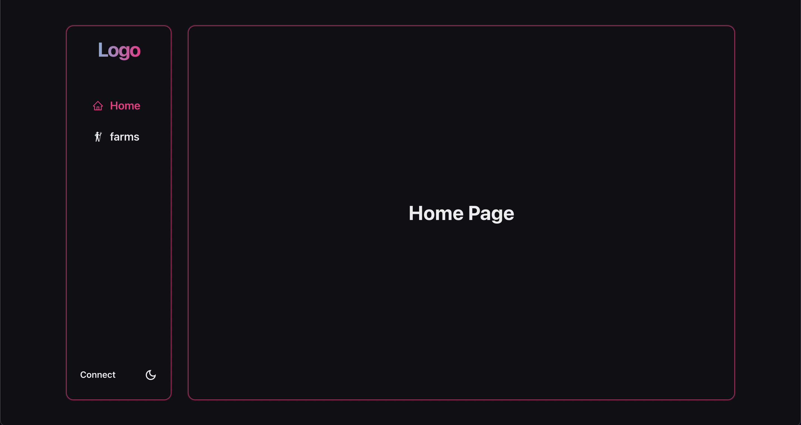
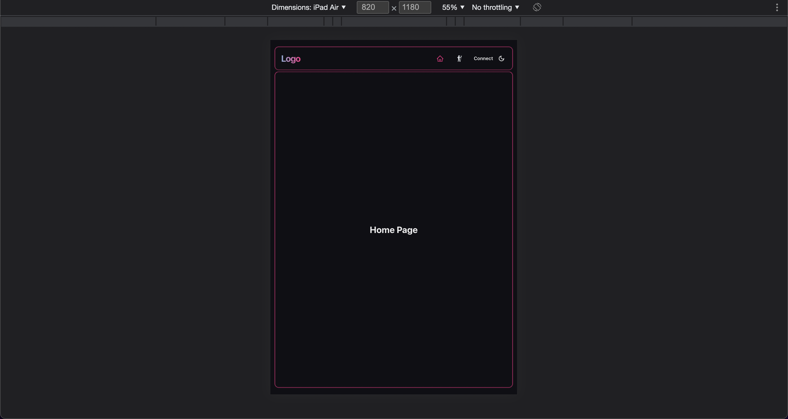

# tezos-dapp-template-next

Simple starting template for a dApp frontend built on the tezos network using Nextjs and Chakra-ui,
with responsiveness and accessibility in mind.

## Technologies

| name                                                                                | version |
| ----------------------------------------------------------------------------------- | ------- |
| [Nextjs](https://nextjs.org/)                                                       | ^12.0.7 |
| [typescript](https://www.typescriptlang.org/)                                       | ^4.5.4  |
| [Chakra-ui](https://chakra-ui.com/)                                                 | ^1.7.4  |
| [react-icons](https://react-icons.github.io/react-icons/)                           | ^4.3.1  |
| [@taquito/taquito](https://tezostaquito.io/docs/quick_start)                        | ^11.1.0 |
| [@taquito/beacon-wallet](https://docs.walletbeacon.io/getting-started/installation) | ^11.1.0 |
| [@taquito/tzip16](https://tezostaquito.io/docs/metadata-tzip16)                     | ^11.1.0 |

## Installation

-   Clone normally or with the [degit](https://www.npmjs.com/package/degit) package.
-   Run `yarn` from the root of the project folder to install dependancies.

## Scripts

-   `yarn dev` : runs project in development mode on port 3000.
-   `yarn lint` : runs eslint.
-   `yarn build` : runs next build.

## Screenshots

